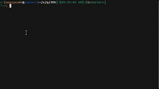

### ***MAKE SURE PIP3 IS INSTALLED ON YOUR SYSTEM***

# Automatic way

just run the setup.sh file

### NOTE YOU MUST BE ON A DEBIAN-BASED OS TO WORK
if you are on any other linux distro then you need to try to download *portaudio19-dev*

```bash
./setup.sh
```
if it does not start try to give it executible promissions 
```bash
chmod +x ./setup.sh
```



# Manual way

## okay so its kinda a pain to get this started...

Just run these commands in the term

**THIS IS ON A DEBIAN-BASED COMPUTER, MIGHT BE DIFFERNT FOR YOU**

```bash
pip install gtts
pip install playsound
pip install SpeechRecognition
```

that install all the packages for JVA

next you will need more for *SpeechRecognition*

```bash
sudo apt-get install portaudio19-dev
pip install PyAudio
```

then should be rocking right after!

### THIS WAS TESTED ON AN UBUNTU COMPUTER


